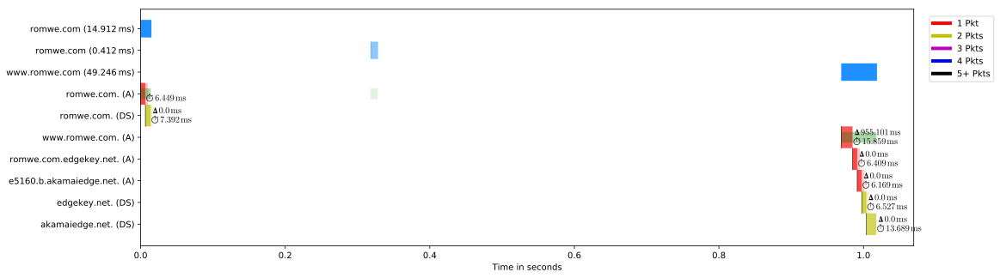

# README

1. [How to Do Stuff](#how-to-do-stuff)
2. [Reasons for Misclassifications](#reasons-for-misclassifications)
    1. [General Troubles](#general-troubles)
    2. [R001](#r001)
        1. [Examples](#examples)
    3. [R002](#r002)
    4. [R003](#r003)
    5. [R004](#r004)
    6. [R005](#r005)
        1. [Example](#example)
    7. [R006](#r006)
        1. [Example](#example)
    8. [R007](#r007)
        1. [Example](#example)

## How to Do Stuff

Mounting a shared folder between KVM and host.

Setting SELinux permissions:

```bash
sudo semanage fcontext -a -t svirt_image_t (pwd)"/share(/.*)?"
sudo restorecon -vR "./share/"
```

Mounting in guest:

```bash
sudo mount -t 9p -o trans=virtio rpmbuild /mnt
```

Get a list of effective TLDs used within the Alexa top X:

```bash
xsv select 2 alexa-top1m.20180611T0204.csv | head -30000 | xargs tldextract | cut -d ' ' -f 3 | sort -u >tlds
```

Split the Alexa list into multiple chunks.
Use the top 10k and distribute it into two chunkgs.

```bash
head -10000 alexa-top1m.20180611T0204.csv | xsv select --no-headers 2- | split --additional-suffix=.txt --number=r/2 --numeric-suffixes - alexa-top10000-rr
```

Run the test in the VMs:

```bash
stdbuf -oL -eL /mnt/scripts/foreach-domain.fish ./alexa-top10000-rr00.txt 2>&1 | ts | tee log.txt
```

Convert the output of `dns-sequences` into a CSV file with all the wrong classifications:

```bash
rg 'Seq:' "$INPUT" | xsv select --no-headers --delimiter=' ' 2,4,6,8 > "$OUTPUT"
```

Domains most often wrongly classified, based on the CSV above:

```bash
xsv select 3 "$INPUT" | sort | uniq -c | sort -n
```

Most common wrong classification results, based on the CSV above:

```bash
xsv select 3,4 "$INPUT" | sort | uniq -c | sort -n
```

## Reasons for Misclassifications

### General Troubles

The normal A + DNSKEY pair does not always occur.
If the effective 2LD is in fact a 3LD, e.g., `olx.co.ao`, and the 2LD already does not provide DNSSEC, then the resolver never tries to perform DNSSEC validation for the 3LD.
Thus, the DNSKEY is missing.

### R001
[R001]: #r001

The website is hosted on a single domain and does not embedd any third-party domain.
Only a single pair of an A followed by a DNSKEY request will be observerd.

#### Examples

`t.co`

### R002
[R002]: #r002

The website is hosted on a single domain and does not embedd any third-party domain.
In contrast to [R001][] is the website hosted under the `www` subdomain and the first action is to redirect to it.
Therefore, the normal A + DNSKEY pair is seen, followed by another A.

### R003
[R003]: #r003

The website is hosted on a single domain and embeds resources from exactly one third-party domain.
The requests show a A + DNSKEY pair, followed by a gap, followed by another A + DNSKEY pair.

### R004
[R004]: #r004

Only a single DNS request is observed, thus not enough entropy is present.

### R005
[R005]: #r005

The website is hosted on a single domain and embeds resources from exactly one third-party domain.
The third-party domain resolves to a CNAME to another domain.
The DNS server first performs the A lookups, on the first third-party domain, then the CNAME redirected one.
Afterwards, DNSKEY requests for boths third-party domains are issued.
Thus, the pattern observes is a A + DNSKEY pair, followed by two A's and then two DNSKEY's.

#### Example

`telegram.org` includes `www.google-analytics.com` as single third-party domain.
`www.google-analytics.com` is a CNAME to `www.google-analytics.l.google.com`, which is another domain.
After an A request for both third-party domains, the server issues DNSKEY requests for both third-party domains.

### R006
[R006]: #r006

A website redirects to the `www` subdomain.
The `www` subdomain is a CNAME to Akamai.
Akamai first uses teh `edgekey.net` domain and then CNAMEs to `akamaiedge.net`, thus causing three A lookups (`www`, `edgekey`, `akamaiedge`) followed by two DNSKEY lookups (`edgekey`, `akamaiedge`).
This is preceded by the typical A + DNSKEY for the main domain, which also explains why there is no DNSKEY for `www`.

#### Example



### R007
[R007]: #r007

An unreachable name server (SERVFAIL) causes many requests for the A record but never a DNSKEY.

#### Example

`iyqnxpkzfq.com` and `xcvlescqkwan.com`
