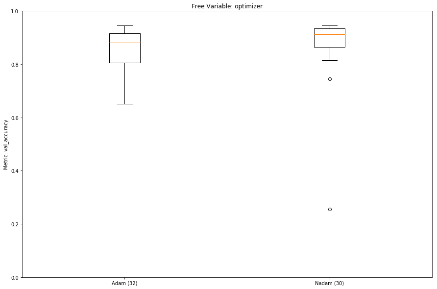

# Experiments

1. [Experiment 1](#experiment-1)
2. [Experiment 2](#experiment-2)
3. [Experiment 3](#experiment-3)

The analysis script for the experiment result data can be found together with the [Jupyter notebooks](../../notebooks/Keras%20Hyperparameter%20Analysis.ipynb).

## Experiment 1

Optimization Matrix:

```python
p = {
    "activation": ["elu", "linear", "relu", "sigmoid", "softmax"],
    "batch_size": [20, 40, 100],
    "clipnorm": [None, 0.1, 1.0, 10.0, 1000.0],
    "dropout": [0, 0.25, 0.5, 0.75],
    "epochs": [100],
    "hidden_size": [32, 64, 128, 256],
    "layers": [1, 2],
    "recurrent_dropout": [0, 0.25, 0.5, 0.75],
    "optimizer": [
        keras.optimizers.Adadelta,
        keras.optimizers.Adam,
        keras.optimizers.Nadam,
        keras.optimizers.RMSprop,
    ],
}
```


We learn, that the tree activation functions `elu`, `linear`, and `relu` are not suitable for us.

The following graphs are based on data in which those three activation functions are already eliminated.


Larger hidden sizes seem to work better, however, this is only if we check after 100 steps.
The models are slow in learning if we look at the number of steps, however they are quick in terms of wall clock time the training takes, so based on the wall clock time they could train more and reach higher accuracy.
Notice how the lines which low accuracy are very step, showing the little wall clock time they take for learning.
They all have a `hidden_size` of 32 and take in the order of 5 to 10 minutes to train.
Whereas the networks with a `hidden_size` of 256 reach over 90%, but can take over 3 hours to learn (green: 2:22h and orange 3:13h).


High values of `dropout` and `recurrent_dropout` also seem decrimental to the performance of the network, but they have smaller sample counts.

<details>
<summary>Dropout Graph</summary>


</details>

<details>
<summary>Recurrent Dropout Graph</summary>


</details>

## Experiment 2

This experiment was performed with 100 randomly selected sequences.

The experiment is based on [Experiment 1](#experiment-1), but with a more refined matrix.

```python
p = {
    "activation": ["sigmoid", "softmax"],
    "batch_size": [20, 40, 100],
    "clipnorm": [None, 0.1, 1.0, 10.0, 1000.0],
    "dropout": [0, 0.25, 0.5],
    "epochs": [100],
    "hidden_size": [32, 64, 128, 256],
    "layers": [1, 2],
    "recurrent_dropout": [0, 0.25, 0.5],
    "optimizer": [
        keras.optimizers.Adadelta,
        keras.optimizers.Adam,
        keras.optimizers.Nadam,
        keras.optimizers.RMSprop,
    ],
}
```

The `batch_size` has an unclear effect on the quality of the model.
A `batch_size` of 100 reduces the learning time for 100 steps by 1/3 to 1/2 compared to a `batch_size` of 20.
However, in a "time vs. accuracy" plot both batch sized perform similarly well per time spent training.

The higher values for `dropout` and `recurrent_dropout` still seem to perform slightly worse than very small values.

<details>
<summary>Dropout Graph</summary>


</details>

<details>
<summary>Recurrent Dropout Graph</summary>


</details>


Setting small values for `clipnorm` seems to improve the performance compared to no value or large values.


The two optimizers `Adam` and `Nadam` perform slightly better than the two alternatives.

## Experiment 3

```python
p = {
    "activation": ["softmax"],
    "batch_size": [20, 40],
    "clipnorm": [0.1],
    "dropout": [0, 0.05, 0.1],
    "epochs": [10, 20, 25, 50, 100, 200, 400],
    "hidden_size": [32, 64, 128, 256],
    "layers": [1, 2, 3, 4, 5],
    "recurrent_dropout": [0, 0.05, 0.1],
    "optimizer": [keras.optimizers.Adam, keras.optimizers.Nadam],
}

# Only configurations with this constraint are tested
boolean_limit=lambda p: (p["layers"] * p["hidden_size"] * p["epochs"]) == 12800
```


From these two pictures we can learn, that the combination of a large `hidden_size`, with many `layers`, and small `epochs` performs poorly.
A better value, at least for our small set of 100 domain, seems to be a low-ish number of layers (1 or 2).

If we look at the Tensorboard graphs, we notice that one and two layer networks learn the quickest.
One layer networks are the quickest, however there is quite a lot of spread in the performance, so the overlap between one and two layers is quite large.



The `Nadam` optimizer seems to have a slight advantage over the `Adam` optimizer.


Dropout does no longer have a large effect on the `val_accuracy`.

# Appendix

<details>
<summary>List of domains for Experiment 2</summary>

1. a8.net
2. aaas.org
3. aawsat.com
4. adcloudiq.com
5. adcolony.com
6. advocate.com
7. alhilalalyoum.com
8. aljazeera.com
9. angularjs.org
10. anz.com.au
11. apartmentguide.com
12. apple.com
13. avgle.com
14. bankmellat.ir
15. behance.net
16. bestproducts.com
17. bitbucket.org
18. blismedia.com
19. boots.com
20. brightcove.com
21. caac.gov.cn
22. campaignlive.co.uk
23. carecredit.com
24. cbp.gov
25. chicagobusiness.com
26. cirquedusoleil.com
27. ckeditor.com
28. coach.com
29. corporate-ir.net
30. cpta.com.cn
31. cztv.com
32. datacamp.com
33. delish.com
34. dion.ne.jp
35. doityourself.com
36. elespectador.com
37. elsevier.com
38. eluniverso.com
39. equifax.com
40. estadao.com.br
41. flashtalking.com
42. getsatisfaction.com
43. gocomics.com
44. google.fr
45. greasyfork.org
46. guancha.cn
47. hackernoon.com
48. hclips.com
49. healthychildren.org
50. hu-berlin.de
51. instapaper.com
52. juksy.com
53. kentucky.com
54. kwqc.com
55. lanl.gov
56. learner.org
57. lu.se
58. lutonghd.com
59. macromedia.com
60. mastercuriosidadesbr.com
61. maybank2u.com.my
62. mediamarkt.de
63. mehrnews.com
64. messenger.com
65. misionesonline.net
66. mixi.jp
67. mohurd.gov.cn
68. mt.co.kr
69. nsfc.gov.cn
70. omaha.com
71. openoffice.org
72. photoshelter.com
73. popads.net
74. privatbank.ua
75. procon.org
76. rateyourmusic.com
77. realgm.com
78. riotgames.com
79. sandisk.com
80. seventeen.com
81. siriusxm.com
82. smadex.com
83. special-offers.online
84. sporcle.com
85. stackexchange.com
86. sz.gov.cn
87. tandfonline.com
88. telenet.be
89. tencent.com
90. theladders.com
91. tianyancha.com
92. timesfreepress.com
93. turbobit.net
94. tvn24.pl
95. vox.com
96. wankoz.com
97. wease.im
98. wnd.com
99. zipcar.com
100. zocdoc.com

</summary>
