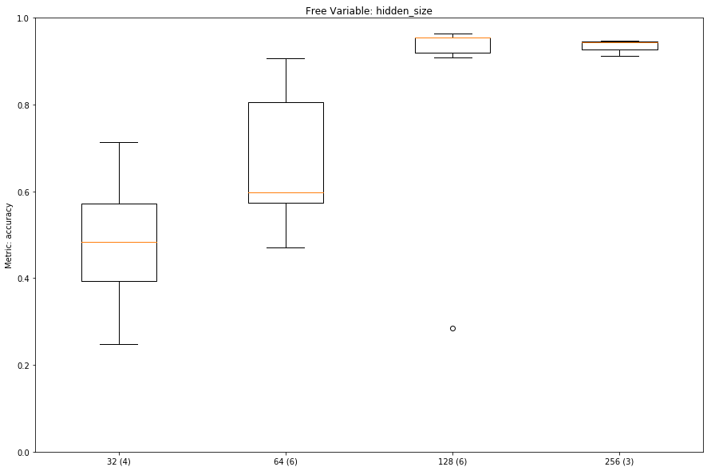
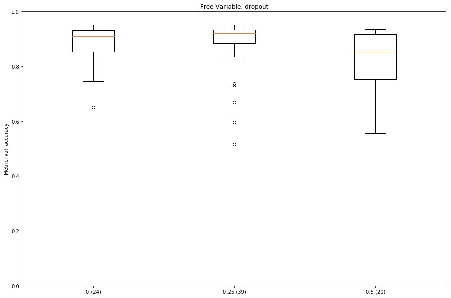

# Experiments

1. [Experiment 1](#experiment-1)
2. [Experiment 2](#experiment-2)

The analysis script for the experiment result data can be found together with the [Jupyter notebooks](../../notebooks/Keras%20Hyperparameter%20Analysis.ipynb).

## Experiment 1

Optimization Matrix:

```python
p = {
    "activation": ["elu", "linear", "relu", "sigmoid", "softmax"],
    "batch_size": [20, 40, 100],
    "clipnorm": [None, 0.1, 1.0, 10.0, 1000.0],
    "dropout": [0, 0.25, 0.5, 0.75],
    "epochs": [100],
    "hidden_size": [32, 64, 128, 256],
    "layers": [1, 2],
    "recurrent_dropout": [0, 0.25, 0.5, 0.75],
    "optimizer": [
        keras.optimizers.Adadelta,
        keras.optimizers.Adam,
        keras.optimizers.Nadam,
        keras.optimizers.RMSprop,
    ],
}
```


We learn, that the tree activation functions `elu`, `linear`, and `relu` are not suitable for us.

The following graphs are based on data in which those three activation functions are already eliminated.


Larger hidden sizes seem to work better, however, this is only if we check after 100 steps.
The models are slow in learning if we look at the number of steps, however they are quick in terms of wall clock time the training takes, so based on the wall clock time they could train more and reach higher accuracy.
Notice how the lines which low accuracy are very step, showing the little wall clock time they take for learning.
They all have a `hidden_size` of 32 and take in the order of 5 to 10 minutes to train.
Whereas the networks with a `hidden_size` of 256 reach over 90%, but can take over 3 hours to learn (green: 2:22h and orange 3:13h).


High values of `dropout` and `recurrent_dropout` also seem decrimental to the performance of the network, but they have smaller sample counts.

<details>
<summary>Dropout Graph</summary>


</details>

<details>
<summary>Recurrent Dropout Graph</summary>


</details>

## Experiment 2

This experiment was performed with 100 randomly selected sequences.

The experiment is based on [Experiment 1](#experiment-1), but with a more refined matrix.

```python
p = {
    "activation": ["sigmoid", "softmax"],
    "batch_size": [20, 40, 100],
    "clipnorm": [None, 0.1, 1.0, 10.0, 1000.0],
    "dropout": [0, 0.25, 0.5],
    "epochs": [100],
    "hidden_size": [32, 64, 128, 256],
    "layers": [1, 2],
    "recurrent_dropout": [0, 0.25, 0.5],
    "optimizer": [
        keras.optimizers.Adadelta,
        keras.optimizers.Adam,
        keras.optimizers.Nadam,
        keras.optimizers.RMSprop,
    ],
}
```

The `batch_size` has an unclear effect on the quality of the model.
A `batch_size` of 100 reduces the learning time for 100 steps by 1/3 to 1/2 compared to a `batch_size` of 20.
However, in a "time vs. accuracy" plot both batch sized perform similarly well per time spent training.

The higher values for `dropout` and `recurrent_dropout` still seem to perform slightly worse than very small values.

<details>
<summary>Dropout Graph</summary>



</details>

<details>
<summary>Recurrent Dropout Graph</summary>


</details>


Setting small values for `clipnorm` seems to improve the performance compared to no value or large values.


The two optimizers `Adam` and `Nadam` perform slightly better than the two alternatives.

# Appendix

<details>
<summary>List of domains for Experiment 2</summary>

1. a8.net
1. aaas.org
1. aawsat.com
1. adcloudiq.com
1. adcolony.com
1. advocate.com
1. alhilalalyoum.com
1. aljazeera.com
1. angularjs.org
1. anz.com.au
1. apartmentguide.com
1. apple.com
1. avgle.com
1. bankmellat.ir
1. behance.net
1. bestproducts.com
1. bitbucket.org
1. blismedia.com
1. boots.com
1. brightcove.com
1. caac.gov.cn
1. campaignlive.co.uk
1. carecredit.com
1. cbp.gov
1. chicagobusiness.com
1. cirquedusoleil.com
1. ckeditor.com
1. coach.com
1. corporate-ir.net
1. cpta.com.cn
1. cztv.com
1. datacamp.com
1. delish.com
1. dion.ne.jp
1. doityourself.com
1. elespectador.com
1. elsevier.com
1. eluniverso.com
1. equifax.com
1. estadao.com.br
1. flashtalking.com
1. getsatisfaction.com
1. gocomics.com
1. google.fr
1. greasyfork.org
1. guancha.cn
1. hackernoon.com
1. hclips.com
1. healthychildren.org
1. hu-berlin.de
1. instapaper.com
1. juksy.com
1. kentucky.com
1. kwqc.com
1. lanl.gov
1. learner.org
1. lu.se
1. lutonghd.com
1. macromedia.com
1. mastercuriosidadesbr.com
1. maybank2u.com.my
1. mediamarkt.de
1. mehrnews.com
1. messenger.com
1. misionesonline.net
1. mixi.jp
1. mohurd.gov.cn
1. mt.co.kr
1. nsfc.gov.cn
1. omaha.com
1. openoffice.org
1. photoshelter.com
1. popads.net
1. privatbank.ua
1. procon.org
1. rateyourmusic.com
1. realgm.com
1. riotgames.com
1. sandisk.com
1. seventeen.com
1. siriusxm.com
1. smadex.com
1. special-offers.online
1. sporcle.com
1. stackexchange.com
1. sz.gov.cn
1. tandfonline.com
1. telenet.be
1. tencent.com
1. theladders.com
1. tianyancha.com
1. timesfreepress.com
1. turbobit.net
1. tvn24.pl
1. vox.com
1. wankoz.com
1. wease.im
1. wnd.com
1. zipcar.com
1. zocdoc.com

</summary>
